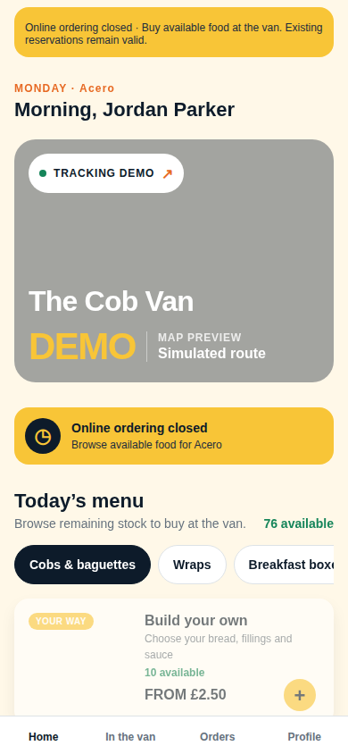
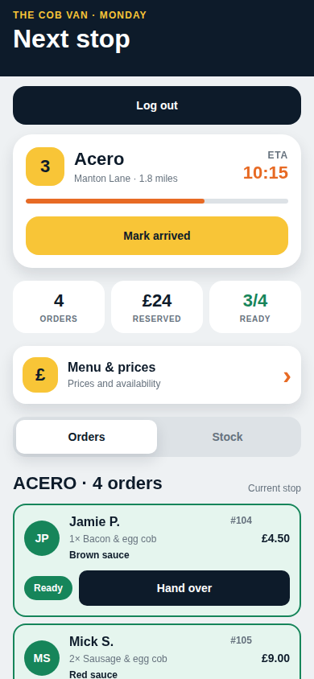

# Cob Van App

Expo app for iOS, Android, and web with Supabase email/password authentication and a local product prototype.

## Screenshots

| Customer app | Van crew workflow |
| --- | --- |
|  |  |

## What is included

- Customer home with tappable live ETA tracking, ready van stock, menu categories, and low-stock prompts
- Product customisation with sauce, quantity, and `Reserve mine`
- Build-your-own cob, baguette, or wrap with live filling prices and a clear order summary
- Working Home, In the Van, Orders, and Profile customer tabs
- One distinct local food photo for every menu item
- New reservations appear immediately in the current-stop driver order list
- Van crew order flow: ready van stock goes straight to `Ready → Collected`; made-to-order food uses `Reserved → Preparing → Ready → Collected`
- Each order shows customer, number, item, quantity, options, price, and status
- Van crew view with next stop, arrival action, order list, and stock split
- Reserved vs walk-in stock visibility to reduce waste
- One-tap walk-up sales and collection both keep physical/reserved stock accurate
- Expo Go-compatible OpenStreetMap tracking view with a moving van marker
- Local arrival notification when the driver starts Stop Mode

Tap the **JP** avatar to open the van crew view, and **CV** to return to the customer view.

## Run locally

```bash
npm install
cp .env.example .env
# Fill in the public Supabase URL and anon key (see below).
npm start
```

Then scan the QR code with Expo Go, or press `w` for the browser preview.

Useful alternatives:

```bash
npm run android
npm run ios
npm run web
```

## Current scope

Authentication and customer workplace membership use Supabase; product data remains realistic local mock data. Menu, orders, stock, map movement and service time remain local/simulated. Map tiles require an internet connection. Real GPS, remote push delivery and app-data persistence are deferred. The van crew view is a development-only prototype preview accessed from Profile; it is not backend authorization. Signing out unmounts and resets the local prototype.

Remote push notifications and background driver location require an Expo development build. Expo Go supports the prototype's map and order flow; notification integration is skipped there so the app can run without the unsupported Android push module.


## Supabase foundation setup

1. Create a development Supabase project. Keep email/password authentication enabled.
2. Apply `supabase/migrations/20260909000100_auth_foundation.sql` once using the Supabase SQL Editor. The migration is transactional. If using the Supabase CLI, initialize/link the project and apply it with `supabase db push` instead; do not apply it twice.
3. Copy `.env.example` to `.env` and set:
   - `EXPO_PUBLIC_SUPABASE_URL`: your project URL (`SUPABASE_URL`).
   - `EXPO_PUBLIC_SUPABASE_ANON_KEY`: your public anon key (`SUPABASE_ANON_KEY`).
4. Restart Expo after changing environment variables; deployed builds must be rebuilt. Expo requires the `EXPO_PUBLIC_` prefix to bundle client environment variables. These values are public app configuration; never use a service-role or secret key. Local env files are gitignored.

Without configuration the app displays a setup message. There is no authentication bypass or hardcoded credential.

If email confirmation is enabled, signup requests the mobile redirect `cobvan://auth/callback` and tells the user to return to Cob Van to sign in. Add that exact URI under **Authentication → URL Configuration → Redirect URLs** in Supabase so GoTrue does not fall back to the project Site URL. The Expo config registers the `cobvan` scheme for development and production builds. Expo Go does not reliably own custom application schemes, so confirmation still succeeds in the browser but the user may need to return to Expo Go manually. This foundation intentionally does not exchange callback tokens or implement magic-link login.

### Session behavior

`src/lib/supabase.ts` follows the [Supabase React Native auth pattern](https://supabase.com/docs/guides/auth/quickstarts/react-native): AsyncStorage on native, browser localStorage on web, `persistSession: true`, `autoRefreshToken: true`, `detectSessionInUrl: false`, and `processLock` on native. Supabase owns storage, token refresh and session invalidation. No password or separate custom session cache is saved by the app.

`AuthGate` waits for `getSession()` / auth events before rendering. A restored session loads the profile from Supabase, then opens workplace onboarding for an unassigned customer or the prototype for an assigned customer. Profile loading/errors block both screens until the profile is available. Native AppState starts refresh while active and stops it in the background; subscriptions are cleaned up on unmount. Expired access tokens are refreshed with the persisted refresh token by Supabase. An invalid refresh session returns to authentication. Transient errors do not trigger a custom forced logout. Session lifetime/revocation settings remain controlled by Supabase.

The accessible **Log out** button calls `supabase.auth.signOut({ scope: 'local' })` to clear this device's session without logging out other devices. Supabase's sign-out event returns to authentication. Failed logout is shown with a retryable button rather than falsely claiming the session was cleared.

### Schema and profile security

- `profiles`: auth user UUID primary key, display name, customer/owner/driver role, nullable workplace and van foreign keys, creation timestamp.
- `vans`: UUID primary key, required owner profile, name, creation timestamp.
- `workplaces`: UUID primary key, required van, name, unique invite code, active flag, creation timestamp.
- An auth-user insert trigger creates the profile atomically, even when signup requires confirmation. Existing auth users are backfilled. Role is always `customer` regardless of signup metadata. This follows Supabase's [profile trigger guidance](https://supabase.com/docs/guides/auth/managing-user-data).
- All three tables have RLS. Authenticated users can select their own profile and update only `display_name`. Column grants prevent changing roles/membership/IDs/timestamps. Anonymous users have no access. Vans remain inaccessible to clients. Workplace column grants and RLS expose only the assigned workplace’s ID and name; invite codes are never readable by clients. The customer-only join RPC is the sole client path to set workplace membership.
- Owner assignment, vans and workplaces are managed manually in the development dashboard/SQL Editor. Public signup always creates a customer and cannot set privileged profile fields. Driver onboarding will require a separate one-time staff invite validated by trusted backend code; it is intentionally not implemented yet. Workplace codes remain separate customer membership codes and must never grant staff roles. Owner references prevent deleting a profile that still owns a van; reassign the van before deleting its owner.

## Validation

```bash
npm test
npm run typecheck
npm run export:web
npx expo-doctor
```

Automated tests cover auth gating, restoration, invalidation events, logout and failure handling, signup confirmation and metadata, and the App's customer/driver routing with stubbed screens. A real Supabase client is tested with a simulated HTTP server response and AsyncStorage adapter for persistence across client recreation, expired-token refresh and logout clearing. The migration is executed in PGlite (embedded PostgreSQL) with a minimal Supabase auth schema to check profile creation/backfill, forced customer role, own-profile RLS, field restrictions, anonymous denial and auth-user deletion.

Validation on 2026-09-09: all 11 tests, TypeScript, web export and iOS/Android bundle exports passed. Expo Doctor passed 20/21 checks; its only failure is the pre-existing Expo patch mismatch (`57.0.20` installed, `~57.0.21` expected). That unrelated upgrade is deferred.

Live Supabase verification on 2026-09-09 passed in the configured web build:

- Email/password signup created an unconfirmed auth user and displayed the confirmation instruction.
- The database trigger created the matching profile immediately with display name `Cob Van Live Test`, role `customer`, and null workplace/van memberships.
- Email confirmation populated `email_confirmed_at`, and password sign-in opened the existing customer prototype.
- Reloading, then closing and reopening the app tab restored the session without requesting credentials.
- Logout returned to authentication. Closing and reopening after logout still showed authentication with empty credential fields.

Native acceptance remains to be completed on physical iOS and Android devices. Force-close and reopen without clearing app storage to verify AsyncStorage restoration, repeat after access-token expiry to exercise refresh, then log out and reopen to verify credentials are required. Also test a revoked/invalid refresh session after access-token expiry; ordinary access-token expiry should refresh without prompting for credentials.

Next recommended backend step: migrate a read-only menu slice with tenant RLS derived from the customer’s workplace and its van. Orders, stock, realtime, GPS, push, payments, analytics, staff invite UI and admin dashboards remain deferred.


## Workplace onboarding setup

In **Supabase → SQL Editor → New query**, run these files in order:

1. If the auth foundation is not installed, run `supabase/migrations/20260909000100_auth_foundation.sql` first. Do not rerun an installed migration.
2. Paste and run all of `supabase/migrations/20260909000200_workplace_onboarding.sql` once.
3. For development, paste and run `supabase/seeds/development_workplace.sql`. This creates **ACERO / ACERO123** using the oldest existing van. If there is no van, set `development_owner_id` in that script to an existing profile UUID, then rerun. It creates a development van without modifying any profile role. The seed leaves an existing `ACERO123` row unchanged.

Restart/reload the app. Sign in with a customer whose `workplace_id` is NULL and enter **ACERO123**. Codes are case-sensitive; outer whitespace is trimmed. Codes are shared and reusable, not staff invites. The join function updates only the authenticated customer's `workplace_id`; it locks the profile to prevent concurrent switching and rejects already assigned customers, non-customer roles and inactive/unknown codes. Direct edits to workplace, role and van fields remain prohibited. No schema redesign or changes to public signup were needed.

After joining, the app refetches the profile and assigned workplace name from Supabase. Home and Profile show that name. Each restored session reads the same persisted membership. If a network response is lost after the server saves membership, **Refresh profile** on the error screen recovers the saved assignment. There is no workplace switching UI.

For a development-only manual reset, run this in SQL Editor with the exact test user's UUID, then log out/in or reload the app:

```sql
update public.profiles
set workplace_id = null
where id = 'YOUR-TEST-USER-UUID'::uuid and role = 'customer';
```

### Workplace validation

Automated validation: 16 tests pass, including execution of both migrations and the seed in PGlite/PostgreSQL, shared code reuse, persisted membership across user sessions, inactive/invalid rejection, no switching, role/van protection, other-user protection, anonymous denial, private invite codes, profile reload/remount, onboarding gating, errors and existing auth/session/navigation regressions. TypeScript and Expo web export pass; the Expo development server starts successfully.

These checks do not apply SQL to the hosted Supabase project. After running the SQL above, complete the live acceptance check: join with ACERO123, inspect `profiles.workplace_id` in Supabase, verify Home/Profile show ACERO, reload and log out/in, and repeat with a second customer. Test an inactive workplace with a fresh unassigned customer. Physical-device force-close/reopen remains a manual check. Existing session storage configuration is unchanged.

Menu, orders, stock, tracking/map route, stop status and service times still use prototype data; they are not tenant-scoped yet. The displayed customer workplace is real, while the existing driver preview and simulated map route remain mock data.
